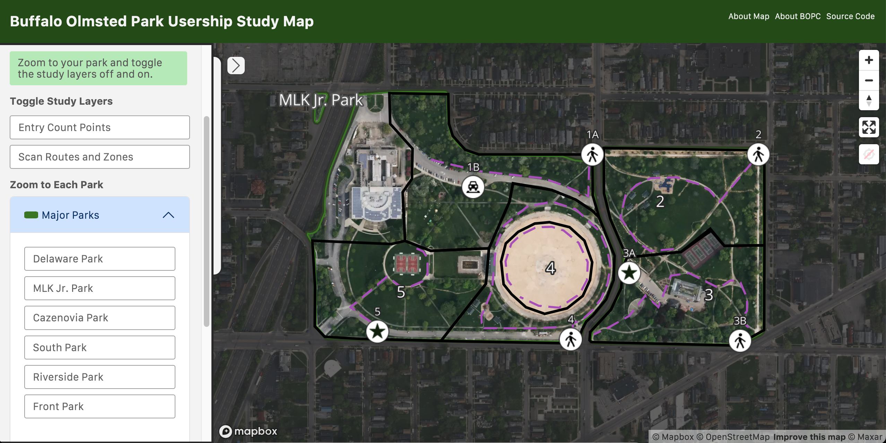
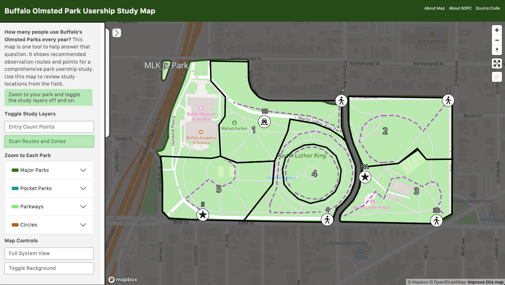
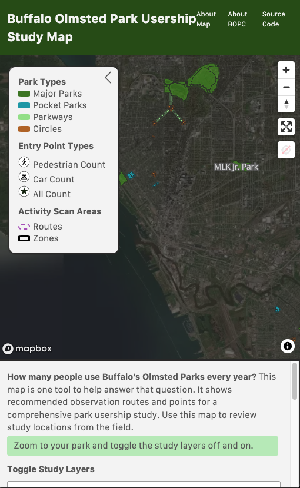
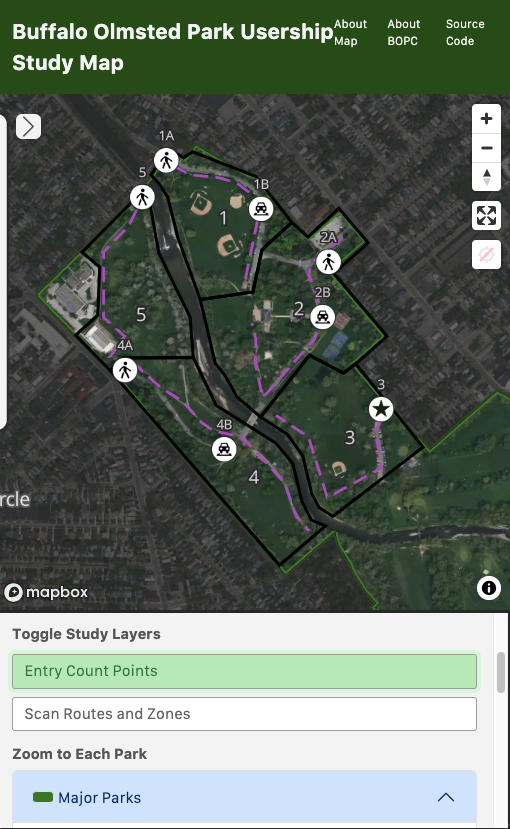

# BOPC Park Usership Study Map
###### Designed for the Buffalo Olmsted Parks Conservancy

This map uses layers designed by my NYU Wagner Student Capstone team for the Buffalo Olmsted Parks Conservancy in Buffalo, NY. We were engaged to create a comprehensive park usership study method. The final method uses two observation activities to collect enough data to create accurate annual usership estimates:
* Entry counts
* Activity scans

Entry counts consist of a field observer counting all individuals who cross an imaginary line to enter the park. Each park has multiple recommended entry points at which the counts should be conducted to get a full understanding of usership.

Activity scans consist of a field observer walking along a designated path doing a visual sweep of all individuals in the visible zone and noting their level of activity. Each park was subdivided into zones and routes.

This responsive map combines these layers to be a field tool for observers who want to make sure they're at the right observation point.

Website is live here: <a href="https://jlsaab.github.io/bopc-park-usership-study/" target="_blank">jlsaab.github.io/bopc-park-usership-study</a>

#### The initial view of map shows some key park assets

#### The view of MLK Jr Park, which has six activity scan routes and seven entry points

#### The view of MLK Jr Park with a different background, for better visibility of nearby street names

#### The mobile view of the map, as it will be seen on a smartphone in the field

#### The view of Cazenovia Park on the mobile interface

